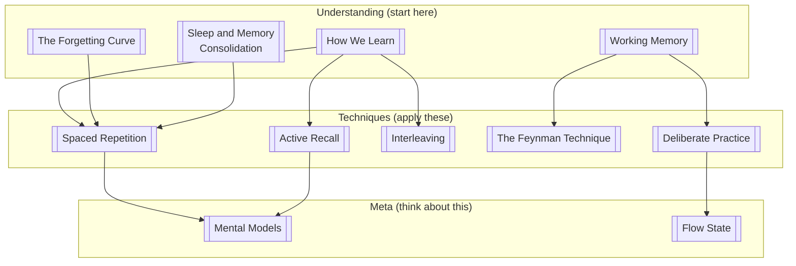

A structured overview of the techniques in this vault, roughly ranked by evidence strength and real-world ROI.

> [!abstract] How to use this note
> This is a map, not a method. Start with the individual notes. Come back here when you want the overview or want to choose what to focus on next.

## Tier 1 — High evidence, high ROI

These have the strongest research support and produce durable long-term retention.

| Technique | Core mechanism | Best for |
|-----------|---------------|----------|
| [[Spaced Repetition]] | Exploit forgetting curve; space reviews optimally | Facts, vocabulary, formulas |
| [[Active Recall]] | Retrieval strengthens memory traces | Everything — the default mode |

## Tier 2 — Strong evidence, requires more effort to apply

| Technique | Core mechanism | Best for |
|-----------|---------------|----------|
| [[Interleaving]] | Discrimination learning; forced retrieval between topics | Problem-solving, multi-topic subjects |
| [[The Feynman Technique]] | Explanation as retrieval + gap detection | Conceptual understanding |
| [[Deliberate Practice]] | Edge-of-ability practice with feedback | Skill acquisition |

## Tier 3 — Valuable but more contextual

| Technique | Notes |
|-----------|-------|
| [[Flow State]] | Can't be forced; useful for integration and motivation |
| [[Mental Models]] | Meta-level — improves the *quality* of what you're learning |

## The Underlying Science

All of these techniques make more sense once you understand:

1. **[[How We Learn]]** — encoding vs. retrieval, the cognitive architecture
2. **[[The Forgetting Curve]]** — why we forget and the mechanism spacing exploits
3. **[[Working Memory]]** — the bottleneck that techniques work around or leverage
4. **[[Sleep and Memory Consolidation]]** — what happens between sessions

## What I Actually Use

Honest current stack:
- **Anki daily** (spaced repetition + active recall, ~15 min/day)
- **Feynman technique** when reading dense material — write the explanation in my own words before moving on
- **Interleaving** — trying to build this habit; still inconsistent
- **Sleep** — protecting sleep more seriously since reading Walker
