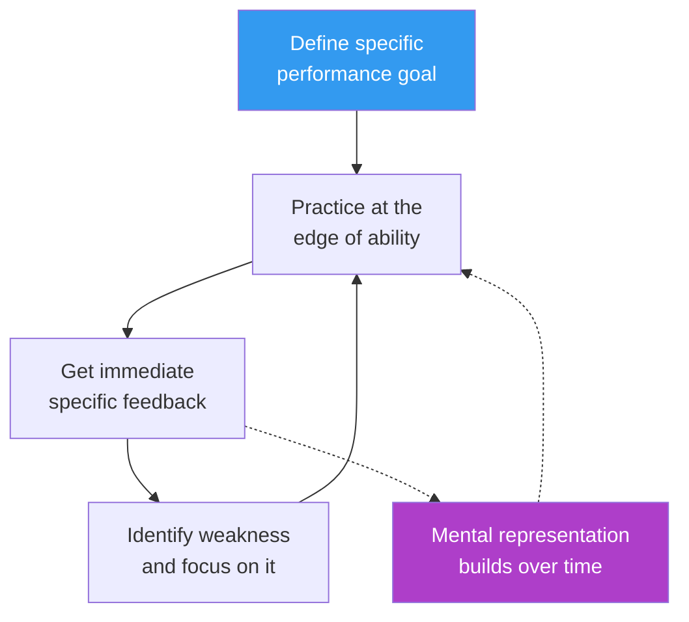

The conventional wisdom is that expertise comes from experience — do something for 10,000 hours and you become an expert. Anders Ericsson spent decades studying expert performers and found this is mostly wrong. It's not hours that matter, it's the *type* of practice.

> [!quote] Anders Ericsson, *Peak* (2016)
> "The most effective types of practice are not what most people do when they tell themselves they are practicing."

## What Makes Practice Deliberate

Four components:
1. **Specific goals** — not "get better at chess" but "improve my endgame pawn structures"
2. **Edge of ability** — the task should be hard enough to require full concentration but not so hard it's impossible
3. **Immediate feedback** — you need to know quickly whether you succeeded or failed
4. **Focus on weaknesses** — experts spend disproportionate time on their worst areas; amateurs avoid them

> [!warning] Experience ≠ expertise
> A surgeon with 20 years of experience who has never tracked their outcomes and never pushed beyond their comfort zone may have 20 years of reinforcing the same habits rather than improving. "Experience" without feedback loops doesn't compound.

## Mental Representations

The real output of deliberate practice is **mental representations** — rich, expert-level ways of perceiving and organizing information in a domain.

This connects directly to [[Working Memory]]: experts don't have more working memory, they have better chunks. A grandmaster sees a board position as 5 configurations; a novice sees 32 pieces.

## The Role of a Teacher/Coach

Deliberate practice almost always involves a teacher or coach, especially early on. The teacher can:
- Identify which weakness to work on
- Design practice tasks at the right difficulty level
- Provide feedback the learner can't generate themselves

This is a structural problem for self-directed learning. In this vault, I try to substitute with:
- Regular testing ([[Active Recall]])
- Worked examples + comparison with my own attempts
- Tracking errors explicitly

## Relationship to Flow

Deliberate practice is *not* [[Flow State]] — in fact it's almost the opposite. Flow is effortless, automatic, enjoyable. Deliberate practice is effortful, uncomfortable, and cognitively draining.

Expert performers tend to spend 1-4 hours per day on deliberate practice (more is unsustainable) and use the rest of their practice time on maintenance and performance.

## What Deliberate Practice Is Not

- Playing the same piece on piano that you've already mastered
- Coding in a language you're already comfortable with on problems you've already solved
- Repeating a skill that no longer challenges you

See [[Interleaving]] for how to structure practice to maximize the deliberate component.
