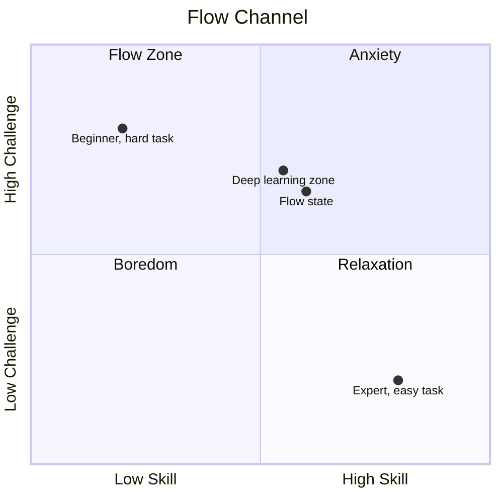

Mihaly Csikszentmihalyi (chick-SENT-me-high) spent decades studying optimal experience. Flow is the mental state of complete immersion in a task — time distorts, self-consciousness disappears, the work feels intrinsically rewarding.

> [!quote] Csikszentmihalyi, *Flow* (1990)
> "The best moments usually occur when a person's body or mind is stretched to its limits in a voluntary effort to accomplish something difficult and worthwhile."

## The Flow Channel

Flow occurs in a narrow band between boredom and anxiety:

Too easy → boredom. Too hard → anxiety. Just right → flow.

> [!note] Flow vs Deliberate Practice
> Interestingly, [[Deliberate Practice]] and flow are almost mutually exclusive. Deliberate practice requires constantly pushing *past* your comfort zone — it's uncomfortable by design. Flow tends to happen when you're working at your *current* edge, not past it.
>
> Both matter. Deliberate practice builds capability; flow states allow that capability to be expressed.

## Conditions for Flow

**Prerequisites:**
- Clear goal for the session
- Immediate feedback on progress
- Challenge/skill balance (see above)

**Environmental:**
- No interruptions (flow takes 15-20 minutes to enter, seconds to break)
- Single task — multitasking is incompatible with flow
- Reduced decision-making before the session

> [!tip] Protecting flow conditions
> Cal Newport's *Deep Work* is essentially a book about engineering the conditions for flow in knowledge work. The core prescription: block 2-4 hour sessions, no notifications, no context switching.

## Flow and Learning

Flow produces some learning, especially early in a skill when challenge naturally meets skill level. But it's not a reliable learning strategy because:

1. You can't force flow — it emerges from conditions
2. Flow tends to produce *fluid performance*, not necessarily *improvement*
3. The most important learning often happens in the uncomfortable moments that precede flow

Where flow genuinely helps learning:
- **Intrinsic motivation** — flow experiences are rewarding, making you want to return to the material
- **Integration** — applying knowledge fluidly cements it in ways that drills can't

## Personal Observations

I get into flow most reliably when:
- I've cleared the first 20 minutes of friction (usually the hardest part)
- The problem is concrete enough to have a clear next step
- I'm not tired (flow seems to require a certain baseline cognitive state)

*Related: [[Working Memory]] — flow may work partly by efficiently managing working memory load through automaticity*
