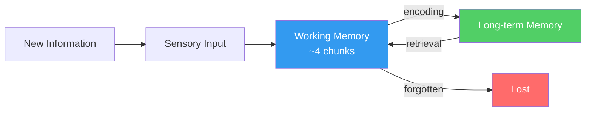

Most people think learning is about *putting information in*. The research says it's actually about *pulling information out*.

## The Two Phases

**Encoding** is when you first encounter something. It's surprisingly unimportant on its own — you can read a page ten times and remember almost none of it.

**Retrieval** is when you try to recall something. Every time you successfully retrieve a memory, you strengthen it. This is the core insight behind [[Active Recall]] and [[Spaced Repetition]].

> [!note] The Encoding Paradox
> The harder it is to encode something (i.e. the more mental effort required), the more durable the memory. Easy learning = shallow learning. This is why [[Interleaving]] and retrieval practice feel *harder* but work *better*.

## Working Memory is the Bottleneck

[[Working Memory]] holds roughly 4 items at once. Everything you're learning has to pass through it. This means:

- Overwhelming a learner with too much at once leads to **cognitive overload**
- Breaking material into smaller chunks helps
- Expertise frees up working memory (experts "chunk" more efficiently)

## Why We Forget

Forgetting isn't a bug — it's a feature. The brain prunes what it thinks is unused. [[The Forgetting Curve]] shows how fast this happens (faster than you'd expect).

The implication: you need to review material **before** you forget it, at increasing intervals. That's the whole idea behind [[Spaced Repetition]].

## Sleep Is Non-Negotiable

Memory consolidation — the process of moving things from fragile short-term traces to stable long-term storage — happens largely during sleep. See [[Sleep and Memory Consolidation]].

> [!warning] Common mistakes
> - Rereading notes (feels productive, low retention)
> - Highlighting (same problem)
> - Cramming the night before (works for tomorrow's test, gone by next week)
> - Studying in the same environment every time (varied context improves recall)

## What Actually Works

The evidence-backed techniques cluster around two principles:

1. **Practice retrieving** rather than re-exposing yourself to material
2. **Space out** that practice over time

See [[Study Methods]] for the full list.
