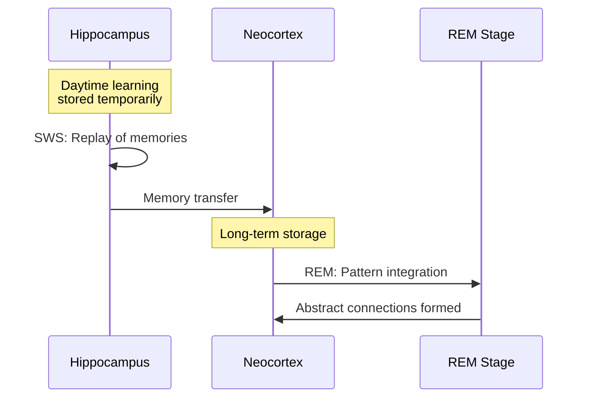

Sleep isn't downtime. It's when the real learning happens.

## What Happens During Sleep

During **slow-wave sleep (SWS)**, the hippocampus replays the day's experiences and transfers them to the neocortex for long-term storage. During **REM sleep**, the brain integrates new memories with existing knowledge, making abstract connections.

> [!info] The hippocampus as temporary buffer
> Think of the hippocampus as RAM — fast and flexible but limited. Sleep moves things to disk (neocortex). Skip sleep and the buffer fills up or gets overwritten.

## The Research

- **Walker (2017)**: One night of sleep deprivation causes ~40% reduction in ability to form new memories the next day
- **Stickgold (2005)**: Sleep improves procedural memory (motor skills, patterns) independently of conscious practice
- **Diekelmann (2010)**: Targeted memory reactivation during sleep — playing sounds associated with studied material during SWS — boosts retention

> [!warning] All-nighters are a trap
> Studying for 8 hours then sleeping beats studying for 16 hours with no sleep. Every time. The all-nighter trades tomorrow's retention for tonight's coverage.

## Naps Work Too

A 20-minute nap after learning can significantly boost retention compared to staying awake. 90-minute naps (full sleep cycle) even more so.

> [!tip] The study-sleep-test stack
> 1. Study material → try to retrieve it (see [[Active Recall]])
> 2. Sleep
> 3. Review once more before the test
>
> This beats any amount of last-minute cramming.

## Connection to Spaced Repetition

[[Spaced Repetition]] schedules reviews across days — this implicitly gives sleep consolidation time to work between sessions. The spacing isn't just about the forgetting curve ([[The Forgetting Curve]]); it's also about giving the brain time to consolidate.

## What I've Noticed Personally

When I'm trying to get something hard into long-term memory (a new programming concept, a language pattern), reviewing it in the evening and sleeping on it works noticeably better than reviewing it multiple times in one morning.

*— need to track this more systematically*
