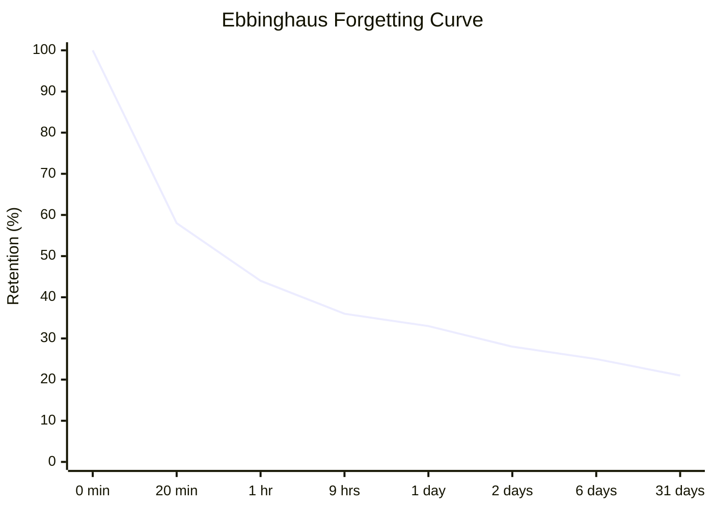
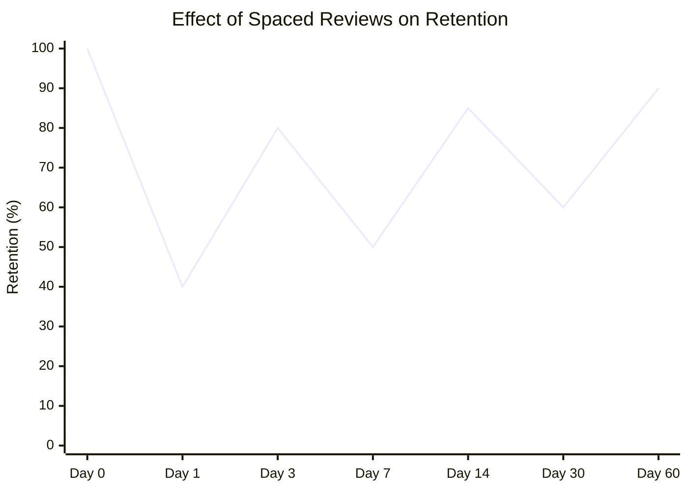

Hermann Ebbinghaus spent years memorizing nonsense syllables and testing himself. In 1885 he published *Über das Gedächtnis* and gave us the forgetting curve — one of the most replicated findings in psychology.

## The Core Finding

Without review, we forget approximately:
- **40%** within 20 minutes
- **60%** within an hour
- **75%** within 24 hours
- **90%+ ** within a week

> [!info] These numbers are for *meaningless* material
> Real-world learning of meaningful content decays more slowly. But the shape of the curve — steep initial drop, then leveling off — holds.

## The Good News: Review Resets the Curve

Each time you successfully review material, the curve flattens. After enough spaced reviews, retention becomes near-permanent.

*Each spike is a review session. The baseline rises each time.*

> [!tip] The optimal review moment
> Review just as you're about to forget — not before (wastes the opportunity) and not after (you've already lost it). This is exactly what [[Spaced Repetition]] systems like Anki calculate for you.

## Spacing Effect

The **spacing effect** is the flip side of the forgetting curve: distributed practice is dramatically more effective than massed practice (cramming).

Cramming works for tomorrow. Spacing works for next year.

This finding directly motivates:
- [[Spaced Repetition]] — systematic scheduling of reviews
- [[Interleaving]] — mixing topics rather than blocking them

## Connection to Retrieval

The forgetting curve assumes *passive* exposure. [[Active Recall]] — actually testing yourself — produces a different curve entirely. The retrieval effort itself strengthens the memory in a way that re-reading simply doesn't.

See [[How We Learn]] for the full picture.
