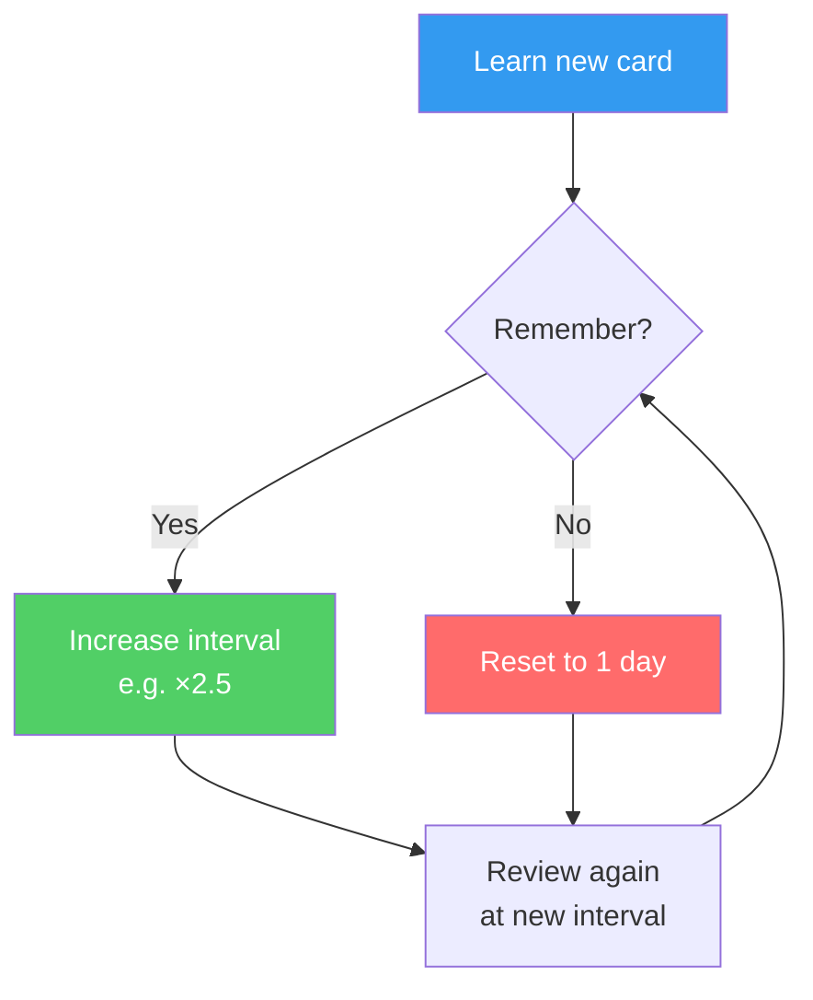

If I had to pick one learning technique to keep, it would be this one. The research is overwhelming and the ROI is unlike anything else.

## The Core Idea

Review material at **increasing intervals** — just as you're about to forget it. Each successful recall resets and extends the next interval.

The algorithm used by most SRS software (like Anki's SM-2) tracks your performance per card and adjusts intervals individually. Cards you find hard get reviewed more often. Cards you nail get pushed out to weeks or months.

## Why It Works

[[The Forgetting Curve]] shows that memory decays over time, but each retrieval practice *strengthens the trace* and *flattens the curve*. Spacing reviews out forces active retrieval ([[Active Recall]]) and gives [[Sleep and Memory Consolidation]] time to work between sessions.

> [!note] Spacing vs Massing
> Massed practice (cramming): feels productive, terrible for long-term retention
> Spaced practice: feels harder, dramatically better for long-term retention
>
> The difficulty is the point. See [[How We Learn]] on desirable difficulty.

## Tools

| Tool | Best for | Notes |
|------|----------|-------|
| **Anki** | Anything text-based | Open source, most powerful algorithm |
| **Obsidian + Spaced Repetition plugin** | Notes you already have | Great for this vault |
| **RemNote** | Combined note-taking + SRS | Good for students |
| **Duolingo** | Language basics | Gamified, limited depth |

> [!tip] Anki tip: make atomic cards
> One fact per card. If you can't answer without remembering "the other thing", split it. Vague cards → vague memories.

## What to Put in Spaced Repetition

Not everything belongs in Anki. Good candidates:
- Facts you need fast and reliable access to (vocabulary, formulas, dates)
- Concepts that unlock other concepts
- Things that keep slipping out of your head

Poor candidates:
- Procedural knowledge (learn by doing, not flashcards)
- Conceptual understanding (that needs [[The Feynman Technique]], not drilling)

## My Current Setup

Using Anki for:
- Spanish vocabulary (~2000 cards)
- Programming syntax and functions
- Key research findings (like the ones in this vault)

Daily review takes about 15 minutes and replaces hours of rereading.

> [!example] Sample card
> **Front:** What is the approximate retention after 24 hours without review?
> **Back:** ~33% (two-thirds forgotten within a day) — Ebbinghaus forgetting curve
