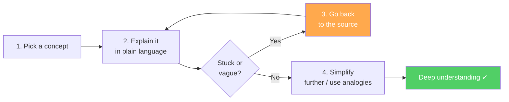

Named after physicist Richard Feynman, who was famous for being able to explain complex topics in plain language. The technique is built on a simple observation: **if you can't explain it simply, you don't understand it**.

## The Four Steps

1. **Choose a concept** you want to understand
2. **Explain it as if teaching a child** — no jargon, no hiding behind technical terms
3. **Notice where you get stuck** — vagueness, circular reasoning, or "I'd have to look that up" are signs of gaps
4. **Return to the source** for the gaps, then try again

Repeat until you can give a clear, simple, jargon-free explanation.

> [!tip] The rubber duck version
> You don't need an actual audience. Explaining to a rubber duck, a notebook, or a voice memo forces the same cognitive process. The key is that you can't hand-wave when you're the one generating the words.

## Why It Works

The Feynman Technique is a structured form of [[Active Recall]] — you're not passively reviewing but actively generating. The attempt to explain forces retrieval. The gaps in your explanation are honest feedback about what you haven't actually encoded.

It also builds **deep, transferable** understanding rather than surface pattern-matching. You can recognize a formula on a test and still fail to apply it to a novel problem if you've only memorized it. Understanding *why* it works lets you adapt it.

> [!note] Jargon as camouflage
> Technical vocabulary lets you feel like you understand something when you've only memorized the words. "The mitochondria is the powerhouse of the cell" — but *why?* What does "powerhouse" actually mean mechanically? The Feynman Technique strips the camouflage.

## What This Looks Like in Practice

I use this when:
- Reading a dense paper or textbook chapter
- Learning a new programming concept (can I explain *why* a closure works, not just that it works?)
- Reviewing notes from a course

The "write an explanation in my own words" section of a note is often where I do this. If I can't write it, I don't have it.

## Relationship to Working Memory and Chunking

Explaining forces you to organize knowledge into a coherent structure — which is exactly how [[Working Memory]] builds efficient chunks. Feynman's famous ability to learn quickly was partly his insistence on never moving on until he could explain clearly.

See also: [[Active Recall]] — the testing effect that makes this work; [[Mental Models]] — the frameworks you're building toward.
